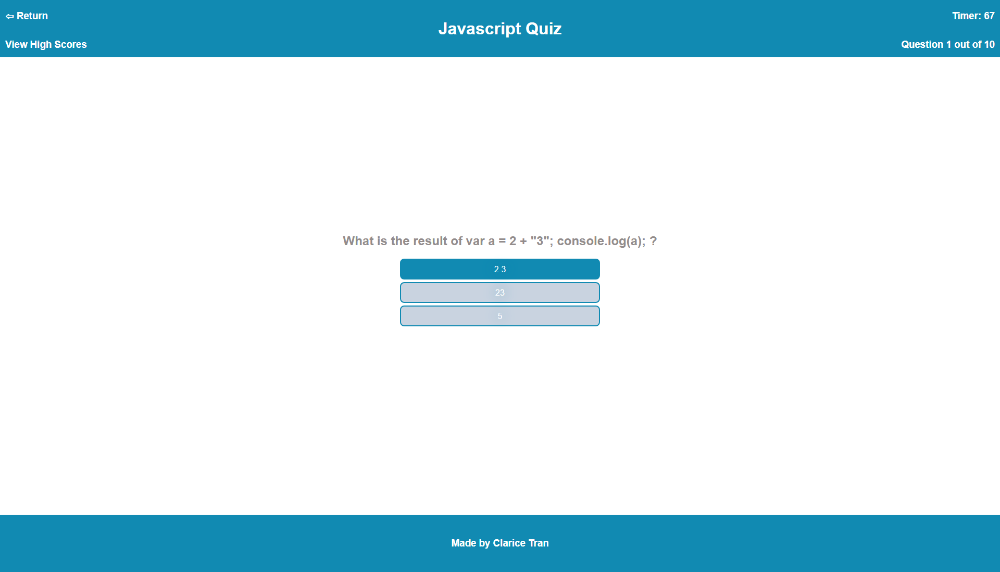
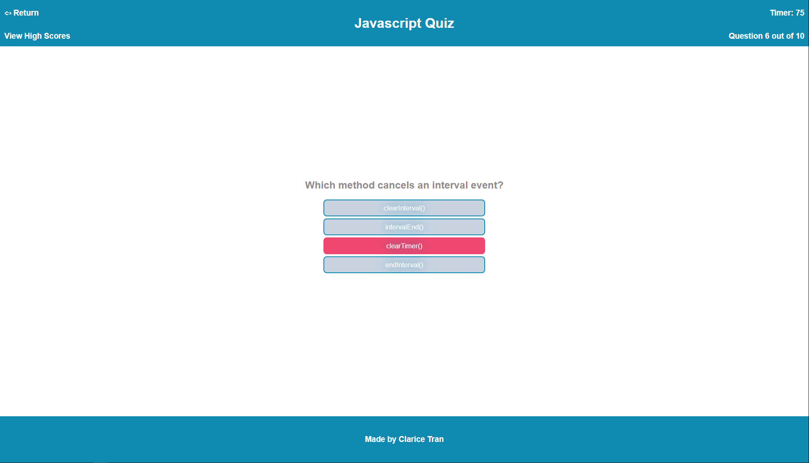

# Quiz Application

## Description

For this application, I created a Javascript quiz out of HTML, CSS, and Javascript to practice using each as well as review and add on to my knowledge of Javascript functions. From creating this application, I was able to create a quiz which grabs a random question from an object array of questions and shrink that array as the user progresses through the quiz. This allowed me to practice working with event listeners and figure out where their placement is appropriate in order for a functional click to work. Since not all multiple choice questions have the same amount of answers I was able to have my quiz work around not having a set amount of answers.

## Installation

The quiz can be found at [this link](https://claricetran.github.io/quiz-application/).

## Usage

This is the starting page which has a link to view the current high scores, a button to start the quiz, and a link to my github.

When the quiz starts, the user will have 100 seconds to complete the quiz. Additional indicators for a decreasing timer and current question out of a total number of questions appear. A link to return to the start page is also available.

Hovering over the buttons on the pages will color in the buttons to indicate the user is hovering over them.

When clicking a correct answer, the button will turn green.

When clicking an incorrect answer, the button will turn red. Additionally, clicking the wrong answer will decrease the timer by 5 seconds.

When the user completes the quiz or if they run out of time, they will be sent to the score screen. The timer and question indicators disappear here. The score is calculated based on how much time is left on the timer when the quiz is completed. The user can enter their initials to submit their quiz score.

If the user hits on the View High Scores link or if the user submits their quiz score, they're taken to the high scores page which lists the recorded scores from highest to lowest.

## Credits

[Tutorial for sorting an array of objects](https://developer.mozilla.org/en-US/docs/Web/JavaScript/Reference/Global_Objects/Array/sort#sorting_array_of_objects)  
[Tutorial for redirecting to another page in Javascript](https://www.w3schools.com/howto/howto_js_redirect_webpage.asp)

## License

MIT License

Copyright (c) [year] [fullname]

Permission is hereby granted, free of charge, to any person obtaining a copy
of this software and associated documentation files (the "Software"), to deal
in the Software without restriction, including without limitation the rights
to use, copy, modify, merge, publish, distribute, sublicense, and/or sell
copies of the Software, and to permit persons to whom the Software is
furnished to do so, subject to the following conditions:

The above copyright notice and this permission notice shall be included in all
copies or substantial portions of the Software.

THE SOFTWARE IS PROVIDED "AS IS", WITHOUT WARRANTY OF ANY KIND, EXPRESS OR
IMPLIED, INCLUDING BUT NOT LIMITED TO THE WARRANTIES OF MERCHANTABILITY,
FITNESS FOR A PARTICULAR PURPOSE AND NONINFRINGEMENT. IN NO EVENT SHALL THE
AUTHORS OR COPYRIGHT HOLDERS BE LIABLE FOR ANY CLAIM, DAMAGES OR OTHER
LIABILITY, WHETHER IN AN ACTION OF CONTRACT, TORT OR OTHERWISE, ARISING FROM,
OUT OF OR IN CONNECTION WITH THE SOFTWARE OR THE USE OR OTHER DEALINGS IN THE
SOFTWARE.
